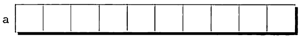

# 📁 1차원 배열

이번 포스팅에서는 8월 19일에 실습한 배열 중에서 1차원 배열에 대해서 정리하려고 합니다.

우선 배열(array)란 `특정 개수의 같은 형을 갖는 자료값을 가는 자료구조`입니다.  
이러한 값들을 원소(element)라고 부르며, 배열 내의 위치에 따라 각 원소를 선택할 수 있습니다.

가장 간단한 형태의 배열은 일차원의 형태입니다. 개념적으로 일차원 배열의 원소들은 한 행(혹은 한 열에)  
순서대로 나열되어있는 구조로 되어있습니다.

## 🤔 어떨 때 사용해야 유용한 건가?

같은 자료형을 가진 연속된 메모리 공간으로 이루어진 자료구조입니다.  
(여러 개의 저장 공간이 한 줄로 나열되어 있는 구조)



이러한 배열은 같은 자료형을 가진 변수들이 여러 개 필요할 때 사용되며 많은 양의 데이터를 처리할 때 유용합니다.

`여러 개의 저장 공간이 한 줄로 나열되어 있는 구조`

1. 데이터의 순서가 중요한 경우
2. 고정된 크기의 데이터를 저장해야 하는 경우
3. 빠른 접근과 검색이 필요한 경우
4. 메모리 사용량을 최적화해야 하는 경우
5. 다차원 데이터를 다루어야 하는 경우

## 👉 배열의 선언 방법...

배열을 선언하기 위해선 우선 배열의 원소들의 형 type과 배열의 크기 number를 결정해야 한다.  
예를 들어 배열 `a`가 10개의 `ìnt`형 원소를 갖는다고 선언하고 싶으면 다음과 같이 선언하면 된다.

배열을 사용하기 위해서는 선언이 필요하다 c언어에서 선언하는 방법은 아래와 같다

```c
int a[10];
```

C언어는 절차지향언어로 메모리에 배열에 해당하는 메모리를 할당해줘야 하기 때문이다.

배열의 원소들은 아무 형이나 가질 수 있으며, 배열의 크기 또한 (정수) 상수식으로 정할 수 있다.  
배열의 길이를 나중에 수정을 해주고 싶다면, 배열의 크기를 매크로 정의를 해주는 것이 좋은 실무 습관이다.

```c
#define N (10)
…
int a[N];
```

### ⇲ 배열의 첨자

배열의 한 특정 원소에 접근하고 싶다면 해당 배열 이름 다음에 대괄호로 감싼 정수값을 적어주면 된다.  
(배열의 첨자[subscript] 혹은 색인[index] 이라고 부른다)  
배열의 원소들은 언제나 0부터 첨자가 시작하기 떄문에 크기 `n`을 갖는 배열의 색인은
`0` 부터 `n-1`까지다.  
예를 들어 배열 `à`가 10개의 원소를 갖는다면 원소들을 각각 a[0], a[1], …, a[9]으로 참조할 수 있다

a[i]의 형태를 갖는 표현식은 왼쪽값이므로 일반적인 변수들처럼 사용할 수 있다:

```c
a[0] = 1;
printf("%d\n", a[5]);
++a[i];
```

## 😡 배열 선언 시 주의사항 !!

배열을 선언할 떄 몇 가지 주의사항이 있다

- 배열의 `index`는 0부터 시작하기 때문에 자칫 배열의 길이가 넘어가는 배열의 요소에
  접근하려고 하면 에러가 나온다 (이 점 항상 유의하자!!)
- 배열을 선언할 때 가능(o)와 불가능(x)

```c
int arr1[3] = {1,2,3}; // 가능

int arr2[3];
arr2[3] = {1,2,3}; // 불가능
```

[중괄호를 이용할 경우 arr1과 같이 한 줄로 선언과 동시에초기화를 해주어야 한다.]

- 배열 길이는 변수로 설정하면 안 된다. 자바가 더 익숙한 사람들에게는 다소 낯설 수 있다.
  c의 경우 배열 길이를 변수로 설정하려면 심볼릭 상수를 선언해서 사용해야 한다.

- `int arr[3] = {1,2}` 나머지는 0으로 저장된다.

## 🧐 배열에서 `sizeof` 연산자 사용법

`sizeof` 연산자는 배열의 크기(바이트)를 결정할 수 있다.  
만약 `a`가 10개의 정수를 갖는 배열이라면 `sizeof(a)`는 보통 40(각 정수가 4바이트를 필요로 한다고 가장)을 갖는다.

sizeof를 통해 a[0]와 같이 배열의 원소의 크기를 측정할 수 있다. 배열의 크기를 원소의 크기로 나누게 되면 배열의 길이를 알 수 있게 된다:

```c
sizeof(a) / sizeof(a[0])
```

몇몇 프로그래머는 배열의 길이가 필요할 경우 아래와 같은 표현식을 사용하기도 한다.  
배열의 a를 초기 상태로 만들어주기 위해서 다음과 같이 해줄 수 있다:

```c
for (i = 0; i < sizeof(a) / sizeof(a[0]); ++i) {
    a[i] = 0;
}
```
