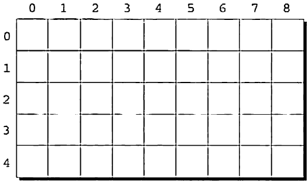
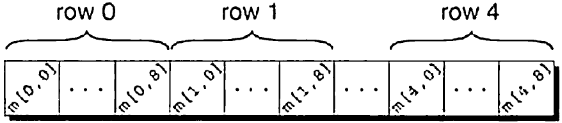

# 📁 다차원 배열

이번 포스팅에서는 다차원 배열(multi-dimensional array)에 대해서 작성해보려고 합니다.

다차원 배열이란? 2차원 이상의 배열을 의미하며, 배열 요소로 또 다른 배열을 가지는 배열을 의미합니다.

즉, 2차원 배열은 배열 요소로 1차원 배열을 가지는 배열이며,  
3차원 배열은 배열 요소로 2차원 배열을 가지는 배열이고,
4차원 배열은 배열 요소로 3차원 배열을 가지는 요소입니다.

## 💻 2차원 배열(two dimensional array)

c에서는 다음과 같이 선언합니다.

```c
int m[5][9];
```

위 선언에 의하면 배열 `m`은 5개의 행과 9개의 열을 갖는다.  
아래 그림에서 알 수 있듯이, 행과 열 둘다 0부터 첨자(subscript)가 시작된다.



`i`번째 형 `j`번째 열에 있는 배열 `m`의 원소에 접근하려면 `m[i][j]`와 같이 작성하면 된다.

위에서 이차원 배열을 표로 시각화를 해주었지만, 실질적으로 컴퓨터의 메모리에 저장되는 형태는 아니다.  
C는 배열을 행 우선 순서row-major order로 저장해주기 때문에 0번째 행이 우선적으로 저장이 되고,  
그 다음 1번째 행 순으로 저장한다.

다음은 `m` 배열이 어떤 형식으로 메모리에 저장되는지에 대한 그림이다.



## 🤔 다차원 배열 초기화

이차원 배열은 일차원 배열 속에서 일차원 배열을 넣어주어 초기화 해줄 수 있다.

```c
int m[5][9] = {{1, 1, 1, 1, 1, 0, 1, 1, 1},
               {0, 1, 0, 1, 0, 1, 0, 1, 0},
               {0, 1, 0, 1, 1, 0, 0, 1, 0},
               {1, 1, 0, 1, 0, 0, 0, 1, 0},
               {1, 1, 0, 1, 0, 0, 1, 1, 1}};
```

모든 내부의 초기자들은 행렬의 한 행에 대한 값을 제공한다.  
고차원 배열의 초기자는 이와 비슷한 방법으로 작성한다.

## 🧐 상수 배열

차원과 무관하게 배열을 const를 선언에 추가해주어 "상수"로 만들어 줄 수 있다.

```c
const char hex_chars[] =
  {'0'. '1'. '2'. '3'. '4'. '5'. '6'. '7'. '8'. '9'.
   'A'. 'B'. 'C'. 'D'. 'E'. 'F'};
```

const로 선언된 배열은 프로그램에 의해 수정될 수 없다.  
컴파일러는 배열의 원소를 수정하려는 모든 시도를 감지할 것이다.

배열을 const로 선언하면 몇가지 장점을 얻을 수 있다.  
우선 프로그램이 배열을 변경하지 않도록 문서화해준다.  
이를 통해 이 코드를 읽을 다른 사람에게 중요한 정보를 전달해줄 수 있다.  
또한 컴파일러가 우리의 의도대로 배열이 수정되지 않도록 오류를 잡아준다.

const는 단순히 배열에만 국한된 것이 아니라, 모든 변수에 가능한다.  
이에 대한 내용은 나중에 다룰 것이다. const는 특히나 배열 선언에 유용한 이유는  
배열은 주로 프로그램 실행 도중에 변하지 않는 값을 갖기 때문이다.
