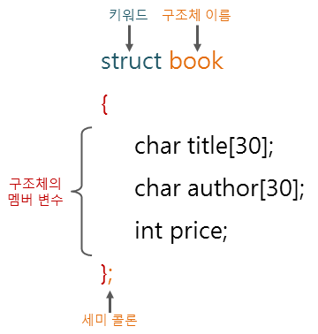

# 📁 구조체

구조체(structure type)란 사용자가 C언어의 기본 타입을 가지고 새롭게 정의할 수 있는 사용자 정의 타입입니다.  
구조체는 기본 타입만으로는 나타낼 수 없는 복잡한 데이터를 표현할 수 있습니다.

배열이 같은 타입의 변수 집합이라고 한다면, 구조체는 다양한 타입의 변수 집합을 하나의 타입으로 나타낸 것 입니다.  
이때 구조체를 구성하는 변수를 구조체의 멤버(Member) 또는 멤버 변수(Member variable)라고 합니다.

## 🤔 구조체의 정의와 선언

C언어에서는 구조체는 `struct` 키워드를 사용하여 다음과 같이 정의합니다.

```c
struct 구조체이름

{

    멤버변수1의타입 멤버변수1의이름;

    멤버변수2의타입 멤버변수2의이름;

    ...
};
```

다음은 book이라는 이름의 구조체를 정의하는 그림입니다.



struct라는 키워드를 사용하여 구조체의 시작을 알리고, 구조체 이름인 book으로 구조체를 정의하고 있습니다.

중괄호 사이에 char title[30], char author[30], int price와 같은 변수들은 book 멤버 변수들 입니다.

마지막 세미콜론은 구조체 정의를 종료한다는 의미입니다.  
이렇게 정의된 book 구조체는 사용자 정의 자료형이라고 합니다.  
이렇게 정의된 구조체 타입은 다음과 같이 구조체 변수로 선언하여 사용할 수 있습니다

```c
struct book my_book;
```

또한, 구조체의 정의와 구조체 변수의 선언을 동시에 할 수도 있습니다.

```c
struct book

{

    char title[30];

    char author[30];

    int price;

} my_book;
```

## 📄 typedef 키워드

C언어의 typedef 키워드는 이미 존재하는 타입에 새로운 이름을 붙일 때 사용합니다.  
구조체 변수를 선언하거나 사용할 때에는 struct 키워드를 사용하여 구조체임을 명시해야 합니다.  
하지만 typedef 키워드를 사용하여 구조체에 새로운 이름을 선언하면 매번 struct 키워드를 사용하지 않아도 됩니다.

typedef 키워드를 사용하여 새로운 이름을 선언하는 방법은 다음과 같습니다.

```c
typedef struct book TEXTBOOK;
```

또한, 구조체의 정의와 typedef 선언을 동시에 할 수도 있습니다.

```c
typedef struct {

    char title[30];

    char author[30];

    int price;

} TEXTBOOK;
```

## 👉 구조체 멤버로의 접근 방법

배열에서는 인덱스를 이용하여 배열 요소에 접근할 수 있습니다.  
하지만 구조체에서 구조체 멤버로 접근하려고 할 때는 멤버 연산자(.)를 사용해야 합니다.

구조체에서 구조체 멤버로의 접근 방법은 다음과 같습니다.

<문법>
구조체변수이름.멤버변수이름

```c
my_book.author
```
