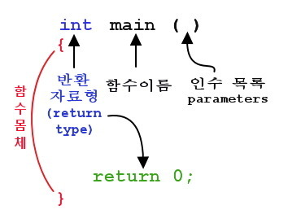
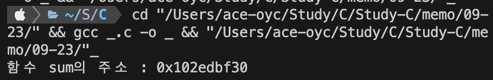

# 📁 함수 포인터

이번 포스팅에서는 C언어 문법 중 함수와 포인터에 대해서 작성해 보려고 합니다.

우선 함수(function)이란? "기능"을 뜻합니다.  
즉, 기능을 구현하는 부분을 따로 떼어 구현하는 것으로, 구조화 프로그램의 중요한 개념이라고 할 수 있습니다.

포인터란? 메모리 주소를 저장하는 변수를 뜻합니다.  
포인터를 사용하면 메모리를 효율적으로 사용하고 데이터를 더 유연하게 다룰 수 있습니다.

함수의 주소를 저장할 수 있는 포인터

## ⇲ 함수의 기본 형태



함수는 위 그림과 같이 반환 자료형과 함수이름, 인수목록으로 나뉩니다.  
반환 자료형이란 메인함수의 사용에서 return 0; 부분을 보면 0을 반환한다는 말인데  
정수형을 반환하므로 여기서 int로 작성되었습니다.

그리고 함수 이름은 main 함수의 경우 프로그램 실행시 가장 먼저 실행되는 부분이므로  
꼭 필요한 함수로 변경할 수 없지만 사용자 정의 함수의 경우에는 일반적인 명명규칙에 따라 사용자가 지정해줄 수 있습니다.

인수 목록은 main 함수에는 보통 아무것도 쓰지 않지만, 사실 괄호안의 void가 생략된 형태이다.

## ⇲ 포인터의 사용법

```c
//[데이터 형식]* [포인터 이름]
int *ptr; //int 타입의 변수를 가리키는 포인터는 이런 형식으로 선언할 수 있습니다.

int num = 42;

//포인터 변수는 선언한 후에는 주소 연산자 '&'를 사용하여 변수의 주소를 얻을 수 있습니다.
int *ptr = &num; //ptr은 num의 주소를 가리키는 포인터
```

## 👉 함수 포인터 문법

```c
// [반환 데이터 형식] ([포인터 이름])([매개 변수 형식]);
int (fp)(int,int);

// fp라는 이름의
// 반환 데이터 형식 : int
// 매개변수 : int 2개로 이루어진 함수의 주소를 저장할 수 있다.
```

## 📝 함수 포인터

변수뿐만 아니라 **함수도 포인터로 가리킬 수 있다**. 함수 포인터랑 위에서도 이야기했다시피 함수를 가리킬 수 있는 포인터를 의미합니다.  
여기서 잠깐 주소를 알아야하는데, 함수에도 주소가 있나?

정답은 예스이다.

간단하게 코드를 예시로 들어 결과 값을 보면

```c
#include <stdio.h>
int sum(int a, int b) {
        return a + b;
}

int main() {
        printf("함수 sum의 주소 : %p\n", &sum);
}
```

이 코드는 아래와 같은 결과를 얻을 수 있다.



위와 같이 16진수로 어떤 수가 나오는데 주소가 있으면 포인터가 있다고 할 수 있다.  
그렇다면 함수 포인터를 선언하는 방법은 매우 간단하다

```c
①int ②(*ptrSum)③(int a,int b)
```

①은 함수의 반환형을 의미합니다.  
②는 함수포인터의 이름을 의미합니다. (변수명과 같이 임의로 정해줍니다.)
③은 매개변수를 의미하비다. 매개변수가 없을 때는 빈 괄호나 void를 사용합니다.

### 👉 void 포인터

---

void : 비어있는, 텅 빈, 공허의  
아무 데이터 형식의 주소나 저장할 수 있는 포인터라고 할 수 있다.

void 포인터는 데이터 형식이 정해져 있는 것이 없기 때문에 일반적으로  
간접 참조 연산자를 사용할 수 없다.

(주소로 찾아가는 것은 가능하지만 그 주소의 저장 공간을 어떻게 사용할 지 모른다!)  
따라서, 간접 참조 연산자를 사용하려면, void 포인터의 형식을 변경해야 한다!

#### ⇲ void 포인터 사용법

---

```c
    void* vp;
    int n = 10;
    float f = 2.78f;
    char c = 'A';

    vp = &n;
    // printf("*vp = %d\n", *vp); //'그냥' 간접 참조 연산자를 사용하는 것은 불가능
    printf("vp = %d\n",*(int*)vp); // void 포인터의 형식을 int 포인터로 변경

    vp = &f;
    printf("vp = %.2f\n",*(float*)vp); // void 포인터의 형식을 float 포인터로 변경

    vp = &c;
    printf("vp = %c\n",*(char*)vp); // void 포인터의 형식을 char 포인터로 변경
```

### 👉 동적 할당

유동적으로 메모리를 할당

**<동적 할당을 사용해야 하는 이유>**
프로그램에서 사용할 메모리의 크기를 예측하기 어렵다!  
따라서, 프로그램을 실행하는 도중에 유동적으로 메모리를 할당할 수 있어야 한다

‼️ 동적 할당을 할때는 <stdlib.h>를 사용해야 한다.

- malloc() : m(memory) + alloc(allocation 할당)
  malloc([메모리 크기]) : [메모리 크기]만큼의 빈 메모리(저장 공간)를 생성.
  반환 데이터 : 생성한 메모리의 주소.

- free() : 메모리 해제(삭제) 함수
  free([동적 할당한 메모리의 주소])
  [동적 할당한 메모리의 주소]에 해당하는 저장 공간을 해제.
  ★★★★ 동적 할당한 메모리는 자동으로 해제되지 않는다!
  따라서 '반드시' free() 함수를 통해서 직접 메모리를 해제해야 한다!

#### ⇲ 동적 할당 사용법

```c
#include<stdio.h>
#include<stdlib.h>

int main(){
    #pragma region 동적 할당
    int* pNum = (int*)malloc(4);
    *pNum = 10;

    printf("*pNum = %d\n",*pNum);

    free(pNum);
    #pragma endregion

    #pragma region float 형식의 동적 할당
    // float 형식의 저장 공간을 동적 할당
    float* pF = (float*)malloc(sizeof(float));
    *pF = 18.24f;
    printf("%.2f", *pF);
    free(pF);
    #pragma endregion


    #pragma region int 동적 할당
    int 10칸 짜리 배열을 동적 할당.
    메모리 크기 : 4 X 10 = 40바이트
    int* arr = (int*)malloc(sizeof(int) * 10);

    for (int i = 0; i < 10; i++)
    {
       arr[i] = i + 1;
       printf("arr[%d] = %d\n", i, arr[i]);
    }

    free(arr);
    #pragma endregion
}
```
