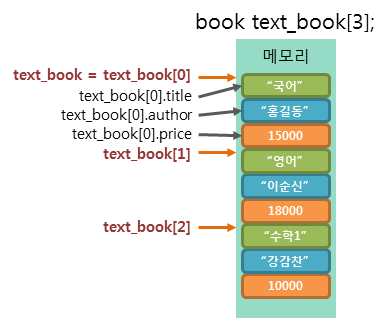

# 📁 포인터와 구조체

이번 포스팅에서는 포인터와 구조체에 대해서 작성해보려고 합니다.

자료를 보면서 글을 작성하다 보면 목차에 대해서 흘러넘기는 그런 경우가 있는데,  
앞으로는 왜 목차가 이런 형식으로 작성되어 있는지 예를 들어 구조체 배열 선언 이면  
구조체 배열 선언에 대해서 4가지의 이야기를 다루고 있다 처럼 기출문제 형식으로 작성해보력 합니다.

## 🤔 포인터와 구조체란? ⓶

1. 포인터(Pointer)
   포인터는 메모리 주소를 저장하는 변수입니다.  
   이 주소는 컴퓨터의 RAM(랜덤 액세스 메모리)에 있는 데이터의 위치를 가리킵니다.

   포인터는 주로 다른 변수나 데이터 구조에 대한 참조를 저장하거나 조작할 때 사용됩니다.  
   (C, C++, C#과 같은 언어에서 포인터가 주로 사용됩니다.)

   **(포인터와 관한 실습 및 정리)**

   - <a href="https://github.com/ohyuchan123/C-Language-sytax-guide/blob/master/08-19/%ED%8F%AC%EC%9D%B8%ED%84%B0.c">포인터 실습</a>
   - <a href="https://github.com/ohyuchan123/C-Language-sytax-guide/blob/master/09-12/%ED%95%A8%EC%88%98_%ED%8F%AC%EC%9D%B8%ED%84%B0.c">함수와 포인터 실습</a>
   - <a href="https://velog.io/@ohyuchan123/%ED%8F%AC%EC%9D%B8%ED%84%B0">포인터 정리</a>

2. 구조체(Struct)
   구조체는 서로 다른 데이터 유형을 하나의 논리적인 단위로 그룹화하기 위해 사용되는 데이터 구조입니다.  
   구조체는 일반적으로 다양한 멤버 변수를 포함하며, 이러한 변수는 다른 데이터 유형일 수 있습니다.

   구조체를 사용하면 데이터를 더 구조화하고 효율적으로 관리할 수 있습니다.  
   (C, C++, C# 및 다른 프로그래밍 언어에서 구조체를 지원합니다. )

   **(구조체와 관한 실습 및 정리)**

   - <a href="https://github.com/ohyuchan123/C-Language-sytax-guide/blob/master/09-16/%EA%B5%AC%EC%A1%B0%EC%B2%B4.c">구조체 실습</a>
   - <a href="https://velog.io/@ohyuchan123/C%EC%96%B8%EC%96%B4-%EA%B5%AC%EC%A1%B0%EC%B2%B4">구조체 정리</a>

## 👉 구조체 배열 선언

C언어에서 배열의 요소가 될 수 있는 타입에는 제한이 없으므로, 구조체 역시 배열의 한 요소가 될 수 있습니다.  
이러한 고조체 배열을 선언하는 방법은 다른 타입의 배열을 선언하는 방법과 같습니다.  
또한, 구조체 배열에서 각 배열 요소로 접근하는 방법도 일반 배열의 접근 방법과 완전히 같습니다.

### 🤔 여기서 배열의 요소가 될 수 있는 타입에는 제한이 없다라는 문장은

C 언어의 유연성과 다양성을 강조하는 것입니다.  
이러한 유연성은 다양한 문제를 해결할 때 도움이 됩니다.  
예를 들어, 정수, 실수, 문자 또는 사용자가 정의한 구조체 등  
다양한 데이터 타입을 배열로 사용하여 복잡한 데이터 구조를 만들 수 있습니다.

다음 예제는 구조체 배열의 선언 및 초기화를 보여주는 예제입니다.

```c
struct book text_book[3] =

{

    {"국어", "홍길동", 15000},

    {"영어", "이순신", 18000},

    {"수학1", "강감찬", 10000}

};
puts("각 교과서의 이름은 다음과 같습니다.");
for(int i=0; i<3; i++){
    printf("%s, %s, %s\n", text_book[i].title);
}

//실행 결과
// 각 교과서의 이름은 다음과 같습니다.
// 국어, 영어, 수학1
```

위의 예제처럼 구조체 배열은 2차원 배열의 초기화 방법과 똑같은 방법으로 초기화할 수 있습니다.
또한, 멤버 연산자(.)를 사용하여 각 배열 요소의 멤버에 접근할 수 있습니다.



## 👉 구조체를 가리키는 포인터

구조체 변수를 가리키는 구조체 포인터는 다음과 같습니다.

```c
struct 구조체이름* 구조체포인터이름;

// 예제
struct book* ptr_my_book;
```

배열의 경우와는 달리 구조체의 이름은 구조체를 가리키는 주소가 아닙니다.  
따라서 포인터에 할당할 때에는 반드시 주소 연산자(&)를 사용해야 합니다.

구조체 포인터를 이용하여 구조체의 멤버에 접근하는 방법에는 다음과 같이 두가지 방법이 있습니다.

1. 참조 연산자(\*)를 이용하는 방법
2. 화살표 연산자(->)를 이용하는 방법

참조 연산자를 이용하는 방법은 다음과 같습니다.

```c
(*구조체포인터).멤버변수이름
// 예제
(*ptr_my_book).author
```

참조 연산자(\*)는 멤버 연산자(.)보다 연산자 우선순위가 낮으므로 반드시 괄호(())를 사용해야 합니다.

구조체의 멤버에 접근하기 위해서 화살표 연산자(->)를 사용할 수도 있습니다.

화살표 연산자의 앞쪽에는 구조체 포인터를, 뒤쪽에는 접근하고자 하는 구조체의 멤버 변수 이름을 사용하면 됩니다

```c
구조체포인터 -> 멤버변수이름

// 예제
ptr_my_book -> author
```
