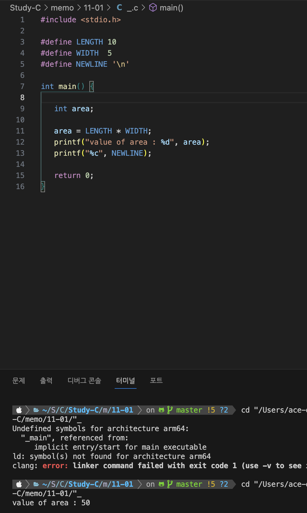

이번 포스팅에서는 C언어의 상수에 대해서 작성하보려고 합니다

목차

1. 상수란 무엇인가?
2. 상수를 정의하는 방법
3. 리터럴 상수

## 🤔 상수란 무엇인가?

---

**상수(Constant)**란 프로그램이 실행되는 동안 '값이 고정되어 변경할 수 없는 메모리 공간'을 의미합니다.
변수와는 정반대라고 할 수 있죠 하지만 상수 또한 변수처럼 정의해서 사용할 수 있습니다.

기본적으로 int나 char와 같은 C언어 표준 자료형들은 모두 상수가 될 수 있습니다.
그렇기 때문에 상수는 *한번 정의한 이후에 값을 변경할 수 없도록 제한한 변수*와 의미가 같다고 볼 수 있습니다.

문자열 그 자체가 값을 나타내는 것을 **리터럴 상수(Literal constant)**라고 하는데 줄여서 리터럴(Literal)이라고 부르기도 합니다.

## 📝 상수를 정의하는 방법

---

상수를 정의하는 방법에는 두 가지 방법이 있습니다.
#define 전처리기를 사용하는 방법과 const 키워드를 사용하는 방법입니다.

### #define 전처리기(Preprocessor)

---

```c
#define identifier value
```

#define으로 전처리기 지시자를 통해 상수를 정의할 수 있습니다.
이렇게 정의된 상수는 전처리 단계에서 value로 치환된 이후 컴파일됩니다.

```c
#include <stdio.h>

#define LENGTH 10
#define WIDTH  5
#define NEWLINE '\n'

int main() {

   int area;

   area = LENGTH * WIDTH;
   printf("value of area : %d", area);
   printf("%c", NEWLINE);

   return 0;
}
```



### const 키워드(Prefix)

---

const 키워드를 통해 변수를 선언할 때 상수로 지정할 수 있습니디ㅏ.

```c
const type variable = value;
```

이렇게 선언된 변수는 값을 변경할 수 없습니다.
실제로 참조할 때는 #define 사용할 때와 차이가 없습니다.

```c
include <stdio.h>

int main() {

   const int  LENGTH = 10;
   const int  WIDTH = 5;
   const char NEWLINE = '\n';
   int area;

   area = LENGTH * WIDTH;
   printf("value of area : %d", area);
   printf("%c", NEWLINE);

   return 0;
}
```

## 👉 리터럴 상수

---

리터럴 상수는 소스 코드상의 문자열이 그 자체로 값을 나타내는 것을 말합니다.
이 값들은 변수에 대입을 하거나 조건문에 비교값으로 사용할 수 있습니다.

### 정수 리터럴(Integer Literal)

---

정수 리터럴은 prefix를 이용하여 10진수, 16진수, 8진수 등의 상수를 표현할 수 있습니다.
0x 로 시작하는 정수 리터럴은 16진수를 나타내며, 0 으로 시작하는 정수 리터럴은 8진수입니다.

sufix로 L이나 U를 사용할 수 있습니다.
L은 long, U는 unsigned 를 나타냅니다.


### 실수 리터럴(Floating-point Literal)

---


### 문자 상수(Character Constant)

''로 감싸여진 단일문자를 문자 상수라고 합니다. ''안에는 단일 문자만을 올 수 있습니다.
문자가 2개 이상이면 문자열이 되기 때문에 ""로 감싸야 합니다.

escape 문자인 '\'가 붙은 특수 문자도 올 수 있습니다.
주로 사용하는 '\t'는 탭문자 '\n'은 개행문자에 해당합니다.


